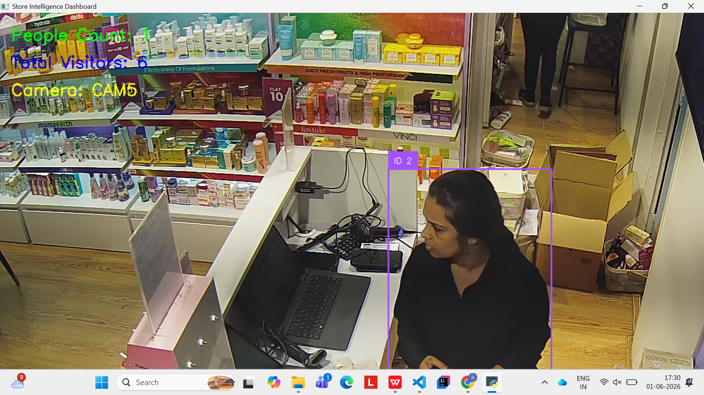
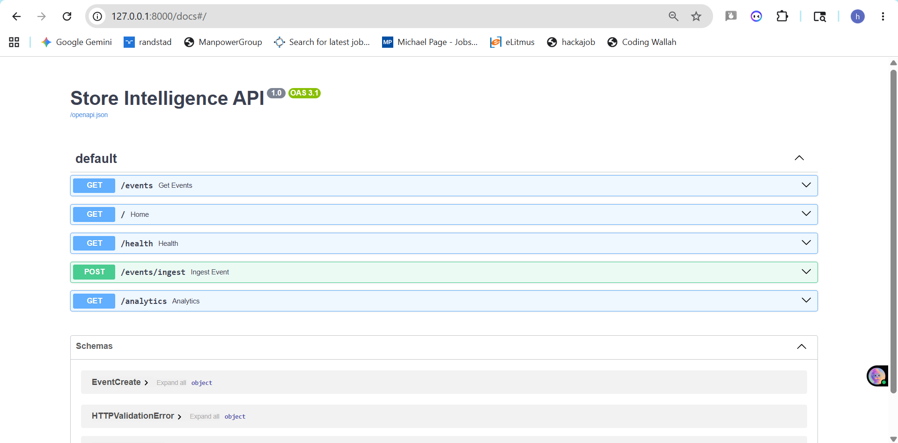
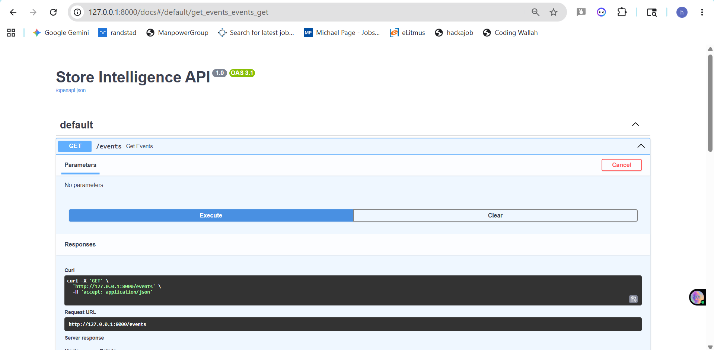
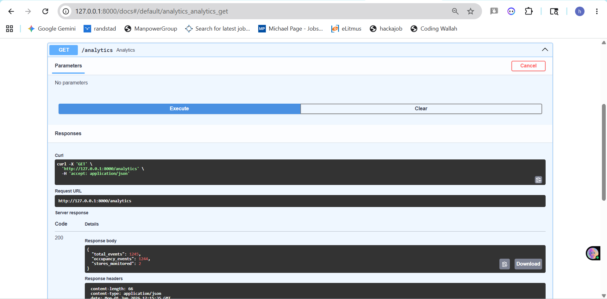

# Store Intelligence System

## Overview

This project is an AI-powered Store Intelligence System built for the Purplle Tech Challenge 2026.

The system processes CCTV streams from 5 store cameras and generates real-time occupancy and visitor analytics through REST APIs.

Using YOLOv8 for person detection and ByteTrack for tracking, the solution monitors store activity, estimates occupancy, tracks unique visitors, and stores events for analytics.

---

## Features

- Multi-camera CCTV processing
- Person detection using YOLOv8
- Visitor tracking using ByteTrack
- Live occupancy counting
- Unique visitor estimation
- Camera-wise monitoring
- Event ingestion through FastAPI
- SQLite database storage
- Analytics API endpoints
- Real-time event generation

---

## Tech Stack

- Python
- YOLOv8
- ByteTrack
- OpenCV
- FastAPI
- SQLite
- SQLAlchemy

---

## Architecture

CCTV Cameras (CAM1–CAM5)

↓

YOLOv8 Detection

↓

ByteTrack Tracking

↓

Occupancy Engine

↓

FastAPI API Layer

↓

SQLite Database

↓

Analytics Endpoints

---

## Project Structure

```text
Store_Intelligence_Challenge/
│
├── app/
│   ├── main.py
│   ├── models.py
│   ├── schemas.py
│   └── database.py
│
├── pipeline/
│   └── detect.py
│
├── data/
│   ├── CAM1.mp4
│   ├── CAM2.mp4
│   ├── CAM3.mp4
│   ├── CAM4.mp4
│   └── CAM5.mp4
│
├── screenshots/
│   ├── dashboard.png
│   ├── docs.png
│   ├── events.png
│   └── analytics.png
│
├── requirements.txt
├── store_intelligence.db
├── yolov8n.pt
└── README.md
```

---

## API Endpoints

### Health Check

```http
GET /health
```

### Ingest Event

```http
POST /events/ingest
```

### Get Events

```http
GET /events
```

### Analytics

```http
GET /analytics
```

---

## Camera Mapping

| Camera | Purpose |
|----------|----------|
| CAM1 | Product Zone Monitoring |
| CAM2 | Product Zone Monitoring |
| CAM3 | Entrance Monitoring |
| CAM4 | Staff / Inventory Area |
| CAM5 | Billing / Store Operations |

---

## Key Metrics Generated

- Live Occupancy Count
- Total Visitors
- Camera-wise Monitoring
- Event History
- Store Analytics

---

## Sample Analytics Output

```json
{
  "total_events": 1245,
  "occupancy_events": 1244,
  "stores_monitored": 2
}
```

---

## How to Run

### Install Dependencies

```bash
pip install -r requirements.txt
```

### Start FastAPI Server

```bash
uvicorn app.main:app --reload
```

### Run Detection Pipeline

```bash
python pipeline/detect.py
```

### Open API Documentation

```text
http://127.0.0.1:8000/docs
```

---

## Future Improvements

- Dwell Time Analytics
- Heatmaps
- Queue Detection
- Re-identification Across Cameras
- Live Dashboard
- Anomaly Detection
- Customer Journey Analytics

---

## Screenshots

### Dashboard


### API Documentation


### Events API


### Analytics API
